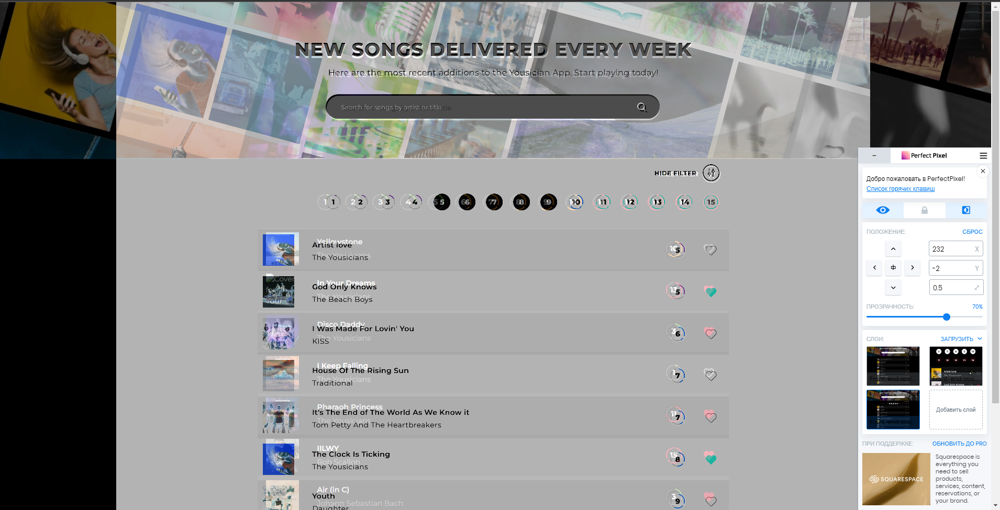

## Project build with Next.js


```bash 
# Open the project folder 
cd yousician
# Install dependencies
npm install
```

npm run dev - START YOUR SERVER and APP

APP will be available on http://localhost:3000
```bash
npm run dev
# or
yarn dev
# or
pnpm dev
```

## About the project
For the structural system, I chose the https://feature-sliced.design/ approach.
`application` - is a folder for everything related to the entire application. (global styles, redux, etc.)
`widget` - large independent structures (search, song list, filters)
`feature` - small independent structures, for example, favorites. Songs, albums, collections can all be favorites. All of this will have the same logic for adding/removing, but a different API passed from the widgets.
`app` - Next dictates the routing structure.
`entities` - entities from the database, set up from the API, types, etc.
`shared` - Things that can easily be transferred to another project. Common hooks, UI...

## Design system
Tailwind + scss modules
Tailwind allows us not to expand the codebase as the project grows. I use scss modules in lists to avoid bloating the resulting HTML. With 1000+ songs, adding styles to each one would be a problem.
I also believe in "the fewer tags, the better". Look at how I made <Level> with just one div.

In terms of pixel perfect, the widget looks almost 100% identical.



## Tests
Tests are written using Jest and React Testing Library. (Tests located not only in `src/__tests__` but also in `components folders`)
```bash
npm run test
```

I've covered almost 100% of the application with tests, but unfortunately, I didn't manage to finish everything. I need one more day. I didn't complete a couple of tests and the screenshot tests.

## About the project

The application operates on useInfiniteQuery and RTQ.
They offer caching, data updating, and polling out of the box. To avoid passing arguments too deeply from the search, I use Redux Toolkit.

A question might arise: why have a separate Redux Slice for filters and for search? But this is the feature-sliced methodology. They are distinct modules and should remain independent. If we decide to remove or modify the filters, all their information is contained within their folder. These modules are isolated, which facilitates the expansion and modification of the project.

- I also use the `useDebounce` hook to avoid unnecessary requests to the server.
- Loading for loading images and favorites.
- All important variables have been moved to constants and are edited from a single location.

Starting from Monday, I had only four evenings to work on this project. And I believe I did quite well. Thank you for this challenge; I enjoyed it. I hope to see you in the interview.